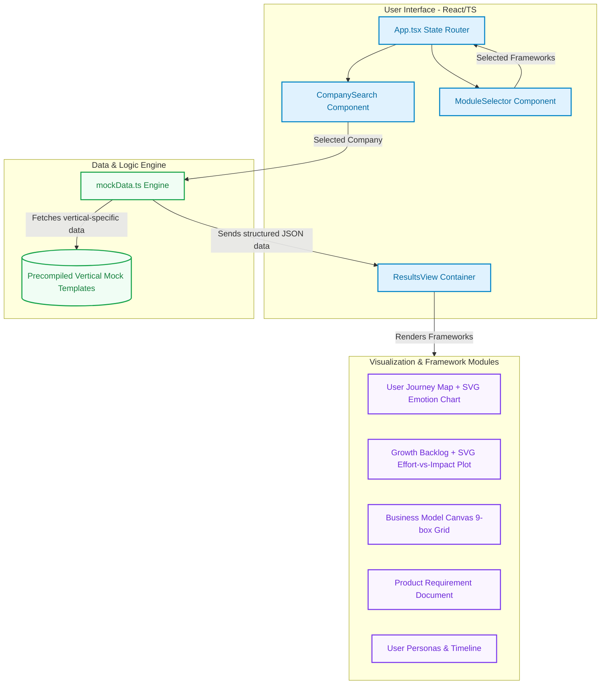

# Product X-Ray - Product Teardown Platform

**Live URL:** [https://product-x-ray.vercel.app/](https://product-x-ray.vercel.app/)

Product X-Ray is an interactive product management tool designed to generate instant, full-spectrum product teardowns for popular global and Indian companies. 

Developed by **Pavitra Poojary**, the application provides structured, visual product breakdowns tailored to 25 target companies across several major business verticals.

---

## 🎯 Purpose & Motivation

Product X-Ray was built to solve a key challenge faced by aspiring Product Managers (PMs), Business Analysts, and Designers: **accessing structured, visual, and framework-driven teardowns of popular companies instantly.**

### Why it was built:
1. **Framework-Driven Learning**: Business case studies are often long, text-heavy PDFs. This platform breaks down complex company cases into actionable PM frameworks (such as Jobs-To-Be-Done, Business Model Canvases, User Journey Maps, and PRDs) all in one interactive view.
2. **Visual PM Sandbox**: Rather than reading static tables, the app demonstrates how key PM artifacts can be interactive—featuring dynamic SVG emotion charts tracking satisfaction along a user journey, and interactive Effort-vs-Impact scatter plots for backlog prioritization.
3. **Speed & Accessibility**: By compiling high-fidelity industry-specific mock data, the app offers instant analysis for 25 major companies across FinTech, E-Commerce, Food Delivery, and Mobility verticals without network latency, API rate limits, or login walls.

---

## 🚀 Key Features

1. **Curated Product Selection & Company Directory**: Allows switching between a quick search-dropdown view or a full visual **Company Directory** gallery containing cards with offline-capable **custom vector logos** and industry filters.
2. **7 Key Product Modules**:
   - **User Personas**: Details demographics, goals, frustrations, and product feature matches.
   - **Jobs To Be Done (JTBD)**: Maps functional, emotional, and social jobs into *Situation ➔ Motivation ➔ Outcome* cards.
   - **User Journey Map**: Charts user actions, pain points, opportunities, and displays an **interactive SVG emotion line graph** tracking satisfaction.
   - **Business Model Canvas**: Displays a classic 9-box business canvas matrix (Partners, Activities, Resources, Values, Channels, Segments, Costs, and Revenues).
   - **Feature & Growth Backlog**: Recommends 8 custom feature ideas in a sortable table with an **interactive SVG 2x2 Effort-vs-Impact scatter plot**.
   - **Product Requirement Document (PRD)**: Generates a complete lean spec with problem definitions, success metrics, checklists for user stories, in/out scope divisions, and risks.
   - **Company Timeline History**: Displays a vertical milestones timeline.
3. **Smooth Local Mock Engine**: Bypasses external APIs to guarantee instant, high-fidelity, vertical-specific local teardowns.
4. **Light Pastel Theme**: Offers a modern SaaS-style user interface utilizing a soft lavender, mint, and peach color scheme.

---

## 📂 Project Architecture

```text
├── src/
│   ├── components/
│   │   ├── CompanySearch/     # Landing Screen & Search dropdown
│   │   ├── ModuleSelector/    # Multi-select configuration screen
│   │   ├── ResultsView/       # Stacked document viewer & SVG visualizations
│   │   
│   ├── services/
│   │   ├── mockData.ts        # Dynamic vertical-based mock data generator
│   │   
│   ├── App.tsx                # State router and header/footer wrapper
│   ├── index.css              # Light theme design tokens & animations
│   └── main.tsx               # App bootstrapper
├── .env.example               # Environmental key templates
├── package.json               # Package dependencies & scripts
└── PROJECT_DETAILS.md         # Project documentation (this file)
```

### High-Level Architecture Flow



---

## ⚙️ Why Local Mock Data? (Architectural Decision)

For demonstration and public hosting purposes, Product X-Ray utilizes a high-fidelity local mock engine rather than real-time LLM API fetches. This design decision was made due to several key factors:

1. **API Key Safety & Token Costs**: Generating comprehensive, structured product teardowns (such as User Journeys, Business Model Canvases, and PRDs) requires heavy LLM token usage. Exposing private API keys in a client-side environment is insecure, and paying for backend token costs for a public portfolio demo is unsustainable.
2. **Instant Latency & Snappiness**: Bypassing external API calls eliminates network latency and cold starts, allowing the user interface to render complex diagrams and switch between companies instantly.
3. **Guaranteed Structure for UI Visualizations**: The application renders interactive SVG satisfaction line graphs, effort-vs-impact scatter plots, and a 9-box business model canvas. A local, vertical-based data generator ensures the structured inputs match the UI components perfectly, avoiding formatting errors typical of real-time AI generators.
4. **Offline-First Resilience**: Hosting the application as a purely static site on platforms like Vercel allows it to remain lightweight, cost-free, and always online with zero database or API downtime dependencies.

---

## 🎨 Theme Guidelines
The visual identity of Product X-Ray is based on light, clean card elements utilizing a **pleasing pastel design system**:
- **Background**: Soft light-grey (`#f3f4f8`)
- **Card Backgrounds**: Solid white (`#ffffff`) with subtle, clean shadows.
- **Accents**:
  - Teal/Mint: Selected states & primaries (`#0d9488` / `#14b8a6`)
  - Emerald: Goals, success metrics, and high satisfaction (`#10b981`)
  - Pastel Peach/Amber: Moderate parameters and efforts (`#f59e0b`)
  - Pastel Rose: Pain points, risks, and exclusions (`#ef4444`)
